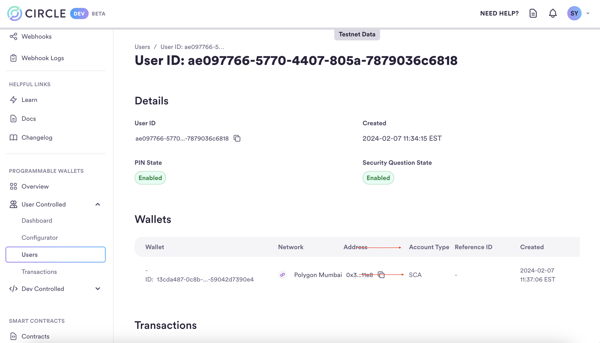

# Create Smart Contract Account (SCA)

The process of creating SCA is almost smae as creating an EOA. In fact, you just need to change one line of code!

## Update Code

You will update the code on the user-controlled-wallets project.

- Once you open the project go to `src/app/api/initialize_user/route.js` file.

- In this file you will the data section of the options object.

- Replace the data section with the following code:

```javascript
data: {
      idempotencyKey: idempotencyKey,
      accountType: "SCA",
      blockchains: ["MATIC-MUMBAI"],
    },
```

As you can see, the only difference here is that you added `accountType: "SCA"`.
This field indicates that you want to create with the account type `SCA`.
When you do not indicate this, then it automatically creates an `EOA` which you have used in the previous section of this course.

Now that you are ready, it is time to actually create the SCA.

## Creating SCA

To create the SCA, you will follow the same steps as you have when you created user controlled wallet.

_Note: You will use the same `API_KEY` and `APP_ID` in the .env.local file._

- Open the `User-Controlled-Wallets` project.
- Run the project with the command `npm run dev`.
- Open the webpage at the `http://localhost:300`
- Firstly, you will create a new user. Retrieve the `user id` and replace the current `NEXT_PUBLIC_USER_ID` with your new one.
- Now, acquire `session token` and `encryption key` and replace your current data with your new `session (user) token` and `encryption key` on `.env.local` file.
- Initialize the user and retrieve the new `challenge id` and update the necessary field in the `.env.local` file.
- Now, it is time to actually create the wallet. In the homepage click on the wallet icon.
- Fill the necessary information exactly as you did when you were creating a wallet in the beginnning of the course.
- Click on verify challenge button and follow the steps on your screen.

## Verify Your New SCA

- Go to the [circle website](https://console.circle.com/home).
- Click `User Controlled` on the menu left.
- Select `Users`
- You will see the newly created user.
- The `PIN State` and `Security Question State` should be enabled with a green background.
- Under the `Created`, you can find when this user has created.
- Click on the user.
- In this page, you should be able to see the account type, which is `SCA`.

You can see the last step in this image:

